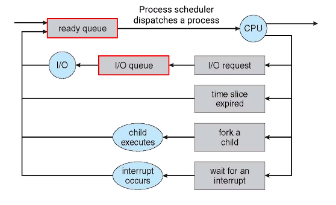

**❓프로그래밍 개념 구분?**

| 개념                                    | 설명                                                                              | 특징                                                                                                                                | 예시                                     |
| --------------------------------------- | --------------------------------------------------------------------------------- | ----------------------------------------------------------------------------------------------------------------------------------- | ---------------------------------------- |
| **유니 프로그래밍 (Uni-programming)**   | 한 번에 하나의 프로그램만 실행하는 방식                                           | - 하나의 프로세스만 실행됨 - 다른 프로그램 실행하려면 이전 프로그램 종료 필요                                                    | MS-DOS 환경에서 하나의 프로그램만 실행   |
| **멀티 프로그래밍 (Multi-programming)** | 여러 프로그램을 메모리에 올려두고 CPU가 실행할 수 있도록 하는 방식                | - CPU가 쉬지 않고 계속 작업 수행 가능 - CPU 스케줄링이 중요 - I/O 작업 중인 프로그램이 있으면 다른 프로그램 실행 가능         | 배치 처리 시스템, 초기 운영체제에서 사용 |
| **멀티 태스킹 (Multi-tasking)**         | 하나의 CPU에서 여러 작업(프로세스 또는 스레드)을 빠르게 번갈아 가며 실행하는 방식 | - 매우 빠른 전환으로 사용자는 동시에 실행되는 것처럼 느낌 - 시분할(time-sharing) 방식 사용 - 프로세스 or 스레드 단위 스케줄링 | Windows, macOS에서 여러 프로그램 실행    |
| **멀티 프로세싱 (Multi-processing)**    | 여러 개의 CPU(코어)를 이용하여 여러 프로세스를 동시에 실행하는 방식               | - 실제로 병렬 처리 가능 - CPU 개수만큼 프로세스 병렬 실행 - 성능 향상 가능                                                    | 멀티코어 CPU에서 여러 애플리케이션 실행  |

**❓멀티 프로그래밍과 멀티 태스킹의 차이?**

✅ 멀티 프로그래밍은 **메모리 관점**에서 여러 프로그램을 메모리에 올려두고 CPU가 필요할 때마다 실행
멀티 태스킹은 **CPU 관점**에서 여러 작업을 빠르게 전환(시분할)하며 동시에 작업하는 것처럼 보임

**❓`exec()`함수는 무엇인가?**

✅ 자식 프로세스가 새로운 프로그램을 실행할 때, 자식 프로세스의 코드, 데이터, 힙, 스택 등을 새로운 프로그램으로 덮어쓰는 함수.

-   자식 프로세스의 메모리 공간을 새로운 프로그램으로 대체하며 `exec()` 이후에는 자식 프로세스 코드가 실행되지 않음.
-   `execl()`, `execp()`, `execv()`, `execvp()`, `execlp()` 등이 `exec()`함수의 계열에 속한다.
-   예제 코드에서 `execlp("InternetBrowser", "0", NULL);` 가 성공적으로 실행되면 자식 프로세스 코드가 새로운 프로세스로 대체되었기에, 하위 `exit(0)` 코드는 영영 실행되지 못하지만 실패 시에는 하위 코드가 실행된다.

**❓좀비 프로세스는 무엇인가?**

✅ 부모 프로세스가 자식 프로세스의 종료 상태를 수거하지 않아 남아있는 프로세스

-   실행되지 않은 채로 PCB만 남아있음
-   메모리를 계속 점유하고 있어, 시스템 자원을 낭비함

**❓쓰레드는 어떤 정보를 포함하고 있는가?**

✅ TCB(Thread Control Block)에 쓰레드의 상태 및 제어 정보를 저장

1. **TID & PID**: 쓰레드 식별 고유 ID, 쓰레드가 속한 프로세스 ID
2. **State**: 쓰레드의 실행 상태 (`Running`, `Waiting`, `Ready`, `Terminated`)
3. **Register Contents**: 스위칭 복원을 위한 CPU 레지스터 정보
4. **Program Counter**: 쓰레드 마지막 명령어 주소
5. **Stack Pointer**: 쓰레드 스택에서 현재 실행 중인 함수 위치 포인터
6. **Priority** : 여러 쓰레드 동시 실행 시, 우선순위

**❓선점형(preemptive) VS 비선점형(non-preemptive)?**

✅ **선점형** 스케쥴링은 하나의 프로세스가 현재 사용중인 CPU의 사용권을 점유할 수 있다.
반대로 **비선점형** 스케쥴링은 하나의 프로세스가 마무리되어야 CPU의 사용권을 할당받을 수 있다.

**❓추가적인 스케쥴링 방식?**

✅

1. **SRTF**(Shortest-Remaining-Time First)

    - SJF의 단점 "100초짜리 A가 실행 중에 1초, 2초의 B,C 프로세서가 준비 상태라면, 100 초를 기다려야 한다"
    - SJF는 **비선점형**이기 때문에 작업을 기다려야 하지만, STCF는 큐의 남아있는 작업 시간을 계산하여 CPU의 점유를 뺏는 **선점형**이다.
    - 100초 A작업 도중 2초 작업 B가 도착하면, A의 남은 작업 시간과 비교하여 짧은 B가 먼저 실행된다.

2. **Priority**

    - **비선점형**: 도착한 프로세스마다 우선순위가 부여되고 동시에 도착한 프로세스의 경우 우선순위로 실행
        - 만약 우선순위가 낮더라도 먼저 실행 중이라면 작업이 종료될 때까지 대기
    - **선점형**: 도착한 순서가 다르더라도 프로세스의 priority에 따라 높은 우선순위 별로 CPU 점유

3. **MLQ**(Multi-Level Queue)

    - 여러 개의 우선순위가 부여된 큐로 관리되며 프로세스의 우선순위에 따라 각 큐에 삽입
    - 프로세스의 타입, 특징, 중요도에 따라 우선순위가 부여 - I/O 작업은 백업과 같은 배치 작업보다 높은 우선순위를 갖는다.
    - 각 큐의 요구조건마다 다른 CPU 스케쥴링 알고리즘을 사용한다.

    1. **고정 우선순위 선점 스케쥴링** (선점형)
        - 큐별로 우선순위가 고정되어 있고, 가장 하위 큐는 상위 큐에 프로세스가 없을 때만 동작이 가능하다.
        - 하위 큐의 프로세스가 동작하는 도중, 상위 큐의 프로세스가 들어오면 CPU 사용권을 빼앗긴다.
    2. **타임 슬라이싱** (비선점형)
        - 큐의 우선순위 별로 CPU 사용 시간의 점유율을 산출한다. > 1순위 50% / 2순위 30% / 3순위 20%

    - 프로세스의 큐 간 이동이 불가하여 유연성이 떨어진다.
    - 특정 큐에 프로세스가 몰리거나 우선순위 큐에 의해 하위 우선순위의 프로세스 대기 시간이 길어질 수 있음(기아 현상)

4. **MFLQ**(Multi-Level Feedback Queue)
    - `MLQ`에서 큐 간 이동이 불가하여 유연성이 부족한 문제 극복
    - 우선순위에 따른 여러 큐가 존재하며 프로세스의 우선순위는 동적으로 변경된다.
    - CPU 점유 시간을 초과하면 우선 순위가 낮아지며, 점유 시간 이내에 작업이 마무리된다면 우선 순위 유지
    - **에이징** - 모든 프로세스를 일정 주기마다 최상위 큐로 이동 / 오래 기다린 프로세스 상위 큐로 승격 (기아 현상 방지)
