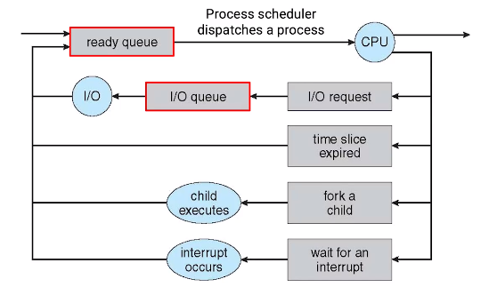

## 💻 CPU 스케줄링

### 📌 CPU 스케줄링 개요

1. 프로그램들이 실행되면 메모리에 올라가 프로세서가 되고
2. 프로세서들은 1개 이상의 쓰레드가 있으며
3. CPU를 차지하기 위해 운영체제의 명령을 기다린다.

✅ **CPU 스케줄링 고려사항**

1. 어떤 프로세스에게 CPU 사용권을 줘야 하나?
2. CPU를 할당받은 프로세스가 얼마의 시간동안 CPU를 사용할 수 있는가?

CPU Burst: 프로세스가 CPU를 할당받아 연속적으로 실행하는 구간
I/O Burst: 프로세스가 입출력(I/O) 작업을 수행하는 구간

### 📌 다중큐

✅ **프로세스 실행 과정**

1. 프로세스가 생성되면 **준비** 상태로 전환
2. 준비 상태에서 CPU 사용권을 받으면 **실행** 상태
3. 실행 중 I/O 요청은 **대기** 상태, 할당시간을 초과하면 **준비** 상태
4. 작업이 끝난다면 **완료** 상태로 전환된다.

✅ **준비 & 대기 상태 관리**

1. PCB 정보 내에 우선순위 정보를 탐색하여 **준비 상태 다중 큐(Ready Queue)** 에 넣는다.
2. 준비 상태 다중 큐에서 운영체제는 적당한 PCB를 선택하여 **실행** 상태로 전환시킨다. (적당한 - 스케쥴링 정책에 따라)
3. I/O 요청으로 **대기** 상태가 된다면 **I/O 작업에 따라 분류된 큐**에 들어간다.
4. I/O 작업이 마무리되면 **인터럽트**를 발생시켜 **실행** 상태로 전환한다.
   준비 & 대기 상태 -> Queue로 관리

### 📌 스케줄링 목표

**1. 리소스 사용률**

-   CPU, I/O device

**2. 오버헤드 최소화**

-   스케쥴링 계산, 컨텍스트 스위칭의 빈도

**3. 공평성**

-   모든 프로세스 공평하게 할당
-   프로세스의 중요도에 따라 상대적으로 공평하게 할당

**4. 처리량**

-   같은 시간 내 더 많은 처리

**5. 대기 시간**

-   작업 요청부터 작업 실행 전까지 대기 시간을 짧게

**6. 응답 시간**

-   작업 응답 시간을 짧게

모든 목표를 동시에 달성할 수는 없다.
**사용자가 사용하는 시스템에 따라 목표를 다르게 설정한다.**

-   터치 스크린 -> 응답시간이 중요
-   과학 계산 -> 처리량이 중요
-   일반 목족 -> 밸런스 유지

### 📌 FIFO

FIFO(First In First Out): 스케줄링 큐에 들어온 프로세스 순서대로 먼저 실행된다.

✅ **특징**

1. 한 프로세스가 완전히 끝나야 다른 프로세스가 시작함.
2. 짧은 작업의 프로세스가 긴 작업의 프로세스를 대기할 수도 있음.
3. I/O 작업을 대기하는 동안 CPU는 다른 작업을 하지 않음 => CPU 사용률 저하

✅ **평균대기시간**
프로세스가 여러 개 실행될 때 모두가 실행되기까지의 평균 대기 시간

-   프로세스\_1 (Burst Time: 25초) - **대기 시간: 0초**
-   프로세스\_2 (5초) - **대기 시간: 25초**
-   프로세스\_3 (4초) - **대기 시간: 30초**

❗️평균 대기 시간: 55 / 3 = 18.3초

-   프로세스\_3 (4초) - **대기 시간: 0초**
-   프로세스\_2 (5초) - **대기 시간: 4초**
-   프로세스\_1 (Burst Time: 25초) - **대기 시간: 9초**

❗️ 평균 대기 시간: 13 / 3 = 4.3초

프로세스 실행 순서에 따라 평균 대기 시간의 편차가 크기 때문에, 현대 운영체제에서는 사용 X
일괄처리시스템에서 주로 사용

### 📌 더 찾아본 점

**❓프로세스를 관리하는 큐의 종류?**
✅ 프로세스들을 관리하는 다양한 큐들이 존재

1. **Job Queue**: 시스템에 있는 모든 프로세스, 운영체제들이 처리해야 할 모든 프로세스
2. **Ready Queue**: 대기 상태의 모든 프로세스, CPU에서 실행될 준비가 된 프로세스
3. **Device Queue**: I/O 혹은 어떤 이벤트를 기다리는 프로세스

프로세스들은 각자 상태에 따라서 여러 큐들을 거쳐간다.

출처: [그림으로 쉽게 배우는 운영체제](https://www.inflearn.com/course/%EB%B9%84%EC%A0%84%EA%B3%B5%EC%9E%90-%EC%9A%B4%EC%98%81%EC%B2%B4%EC%A0%9C/dashboard)
