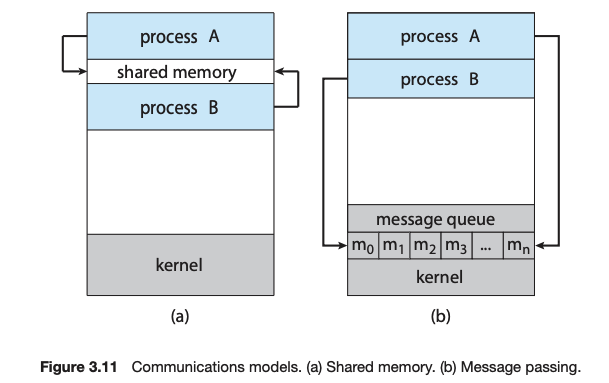

## 💻 프로세스 동기화

### 📌 프로세스 간 통신

다른 프로세스와 데이터를 주고받으며 통신하는 경우

✅ **통신의 종류**

1. 하나의 프로세스 내 쓰레드 간 통신
    - 쓰레드는 **코드, 데이터, 힙 영역 공유**하고 **스택**만 자신의 것을 소유
    - **데이터, 힙 영역**을 통해 공유 가능
2. 한 컴퓨터 내 다른 프로세스
    1. **파일**
        - 하나의 파일을 읽고 쓰는 방법
    2. **파이프**
        - 운영체제가 생성한 파이프를 통해 데이터를 읽고 쓰는 방법
3. 네트워크로 연결된 컴퓨터 내 다른 프로세스
    - **소켓** 통신
    - 다른 컴퓨터 함수를 호출하는 **RPC**(Remote Procedure Call)

### 📌 공유자원과 임계구역

**공유자원**: 프로세스 간 공유되는 변수나 파일 등

**문제점**

1. 프로세스 접근 순서에 따라 값의 결과가 달라질 수 있음.
2. 시분할 처리로 프로레스 간 실행 순서를 예측할 수 없음 -> 연산 결과를 예측하기 힘듦.
3. 동기화 문제가 발생

**임계구역**: 여러 프로세스가 동시에 사용하면 안되는 구역

**상호 배제의 요구사항**

1. 임계영역엔 동시에 하나의 프로세스만 접근한다.
2. 여러 요청에도 하나의 프로세스의 접근만 허용한다.
3. 임계구역에 들어간 프로세스는 최대한 빠르게 나와야 한다.

**경쟁조건**: 공유자원을 서로 사용하기 위해 경쟁하는 것.

### 📌 세마포어

상호배제 메커니즘 중 한 가지.

-   세마포어 변수를 갖고 있는 프로세스가 먼저 실행되고 작업이 완료되면 `signal()`을 통해 변수 반환
-   세마포어 변수가 없는 프로세스는 대기(`wait()`)하다가
-   세마포어 변수를 할당받으면 프로세스가 실행 가능하다.
-   공유 자원의 수에 따라 세마포어의 수가 늘어남

**문제점**

-   `wait()`함수와 `signal()`함수를 잘못 사용하면 문제 발생

### 📌 모니터

세마포어의 단점을 해결한 상호배제 메커니즘

-   운영체제의 차원 X 프로그래밍 언어에서 처리
-   자바에서 `synchronized`가 붙은 함수가 실행되면 다른 프로세스가 접근 불가
-   함수를 임계 영역에 감싸지 않아도 되어 편리함.

### 📌 더 찾아본 점

**❓IPC(Interprocess Communication)이란?**

✅ 프로세스 간 협업을 위해 데이터를 공유하기 위해서는 IPC 기술이 필요하다.

1. **공유 메모리(shared memory)**
    - `Producer-Consumer Problem`: Producer는 정보를 제공하고 Consumer는 정보를 소비 (컴파일러 - 어셈블리어, 웹서버 - 브라우저)
        - 생산자와 소비자를 동시에 작업을 시키기 위해서는 `buffer`를 사용할 수 있다.
        - 생산자는 `buffer`를 가득 채우면 소비자는 `buffer`를 소비한다.
        - 만약 `buffer`가 가득 차면 생산자가 대기, 비어있다면 소비자가 대기 (`wait()`)
        - `buffer`가 `shared memory`로 사용 - 생산자와 소비자가 공유하는 영역
    - 문제점
        - 공유 메모리에 접근하고 데이터를 공유하는 코드를 프로그래머가 직접 작성해야함.
2. **메세지 패싱(message passing)**
    - 운영체제가 협력하는 프로세스 간 메세지 전달 기능을 제공하여 협업이 가능하도록 함 -> 동일한 주소 공간을 공유하지 않아도 협업과 동기화가 가능
    - 프로세스 P와 Q가 소통을 하기 위해 `communication link`를 통해서 `send(message)`, `receive(message)` 메서드 사용
        - Direct or indirect communication
            - `Direct`: 각 프로세스가 명시적으로 프로세스명을 붙여서 데이터 주고 받음 - `send(P, message)`, `receive(Q, message)`
                - Automatic하게 communication link 생성
                - 두 프로세스 사이에 정확히 하나의 링크만 생성
            - `Indirect`: mailbox 혹은 port를 통해 데이터를 주고 받음 - `send(A, message)`, `receive(A, message)`
                - 메일 박스는 메세지를 담거나 제거되는 객체를 추상화시킨 것
                - 두 개의 프로세스가 하나의 메일 박스가 있어야 링크 생성
                - 링크는 두 개 이상의 프로세스에 연결될 수 있음
                - 두 프로세스 사이에는 여러개의 다른 링크가 존재할 수 있음
    - 결국 운영체제는 메일박스에 대한 프로세스의 CRUD를 제공해야 한다.

**IPC design options**

1. **Blocking send**: 메세지를 받을 때까지 생산자는 대기 (sync)
2. **Non-blocking send**: 생산자는 메세지를 보내고 다른 작업 (async)
3. **Blocking receive**: 소비자는 메세지가 사용가능할 때까지 대기. (sync)
4. **Non-blocking receive**: 소비자는 메세지 생성 여부(유효하거나 null이거나)에 상관하지 않고 수신 (async)

Blocking 은 작업(송,수신)이 마무리될 때까지 다른 작업 전환 불가 - sync
Non-blocking은 작업을 실행하고 다른 작업 전환 가능 - async

**❓race condition 이란?**

✅ 다수의 프로세스(혹은 쓰레드)가 같은 데이터를 동시에 접근하거나 처리하면, 실행되는 순서에 따라서 결과가 달라진다.
이를 해결하려면 특정 시간에 **하나의 프로세스만 공유 자원**을 다뤄야 한다. 즉, 프로세스는 **동기적**으로 실행되어야 한다.

**요구사항**

**1. 상호배제(Mutual Exclusion)을 보장해주어야 한다.**

-   한 프로세스가 "임계영역(citical section)"을 실행 중일 때, 다른 프로세스는 임계 영역을 실행할 수 없다.

**2. 데드락(deadlock)을 회피(진행)**

-   임계 영역에 들어갈 프로세스를 정하는 건, 임계 영역에 들어가야하는 프로세스들만 참여할 수 있다. - 영역에 들어가는 과정이 무한정 지연되는 것을 방지

**3. 유한 대기(Bounded Waiting)** (starving 기아 상태 방지)

-   임계 영역에 들어가기를 요청한 프로세스는 무한정 기다리면 안된다.

**❓임계 영역 문제를 해결하기 위한 여러 방법**

✅ 상호배제 메커니즘 여러개

1. **Mutex Locks**: Mutual Exclusion - Mutex

    - 임계 영역에 진입하면 `lock`을 획득(`acquire()`)하고 나갈 때(`release()`)는 반납
    - 프로세스가 임계영역에 진입하기 위해 무한 루프가 돌음 - `busy waiting`
    - mutext lock에서 busy waiting 하며 무한히 도는 것을 `spinlock`이라고도 부름

2. **Semaphore**:

    - 공유자원 수용가능 수에 따라 정수의 변수 `S`로 초기화
    - `wait(S)`, `signal(S)`을 통해 각 작업에서 `S`값을 증가, 차감
    - 0 ~ 1로 `S`가 설정되면 mutex와 비슷 - `Binary Semaphore`
    - 그 이상일 경우는 여러개의 인스턴스를 가진 자원으로 사용 가능 - `Counting Semaphore`
    - 동일하게 `busy waiting`의 문제가 있음
    - `wait`하고 `signal`외의 순서로 호출하면 race condition 발생

출처: [그림으로 쉽게 배우는 운영체제](https://www.inflearn.com/course/%EB%B9%84%EC%A0%84%EA%B3%B5%EC%9E%90-%EC%9A%B4%EC%98%81%EC%B2%B4%EC%A0%9C/dashboard)
