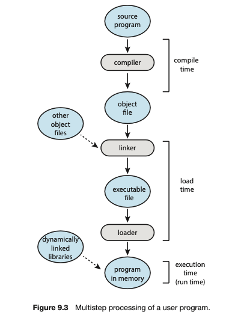

## 💻 메모리

### 📌 메모리 종류

#### ✅ 레지스터

-   가장 빠른 기억장소, CPU 내 존재 (32bit, 64bit)
-   컴퓨터가 꺼지면 데이터가 사라짐(휘발성 메모리)
-   메인 메모리에 있는 데이터를 레지스터에 가져와 연산 후, 메인메모리에 결과 저장

#### ✅ 캐시

-   레지스터와 메인 메모리의 속도차이로 인해 메인 메모리에서 필요할 것 같은 데이터를 미리 캐시에 저장
-   L1 ~ L3 여러 개의 캐시로 구분

#### ✅ 메인메모리(RAM)

-   실제 운영체제와 프로세스들이 저장되는 공간
-   휘발성 메모리

#### ✅ 보조저장장치(HDD, SDD)

-   컴퓨터가 꺼져도 데이터가 사라지지 않음(비휘발성 메모리)
-   프로그램, 파일을 저장

### 📌 메모리 주소

멀티 프로그래밍 환경: 메모리에 여러 프로세스를 올려 동작(I/O대기 시, 다른 프로세스 작업)

주소: 1 byte 크기로 메모리 구역을 나눔 - 물리 주소(절대 주소): 메모리 공간의 실제 주소 - 논리 주소(상대 주소): 사용자가 다루는 메모리 주소

경계 레지스터: 사용자가 접근할 수 없는 운영체제 공간을 분리 - 사용자 프로세스가 침범 시, 메모리 관리자에 의해 강제 종료

1. 사용자가 프로그램 실행 - 사용자 입장에서는 0x0000 메모리로 작업
2. 프로세스는 실제 물리주소 0x4000 주소에 저장
3. 사용자가 0x0100 주소의 데이터 요청 (논리 주소)
4. 논리 주소(0x0100)와 재배치 레지스터(실행 중인 프로세스의 물리주소 - 0x4000)을 더해서 0x4100의 값을 전달

### 📌 메모리 할당방식

❓ 유니 프로그래밍 환경에서는 하나의 프로세스만 메모리에서 동작이 가능하다. 만약 메모리의 용량을 초과한 프로그램을 실행시키려면?

**메모리 오버레이**: 실행시킬 프로세스를 분할시켜, 사용되는 부분을 메모리에 올리고 나머지는 하드디스크 스왑 영역에 저장

-   스왑 과정이 존재하기 때문에 실제 메모리에 전체 프로세스가 올라가있는 것에 비하면 속도가 느리다.

❓ 멀티 프로그래밍 환경에서는 어떻게 동작?

1. **가변 분할 방식**(세그멘테이션): 프로세스가 크기에 따라 메모리를 분리
    - 연속된 메모리 공간에 할당되기에 내부 단편화 현상 없음
    - 외부 단편화 발생: 연속된 공간에 할당을 해야하니 5MB 프로그램을 3MB와 2MB 공간에 할당이 불가하다.
2. **고정 분할 방식**(페이징): 프로세스 크기 상관없이 메모리 분리 (만약 5MB 프로그램을 2MB 고정 분할 메모리에 저장시키려면 `2 / 2 / 1`로 분리) -> **비연속 메모리 할당**
    - 구현이 간단하고 오버헤드가 적음
    - 내부 단편화 발생: 위 예시에서 2MB 분할 공간에 1MB만 사용
3. **버디 시스템**(가변 + 고정): 2의 승수로 메모리를 분할하여 할당
    - 전체 메모리 영역을 하나의 프로세스가 올라갈 수 있을 정도로 2의 승수로 나눠서 분할
    - 최소한의 내부 단편화, 간단한 메모리 합치기

**조각 모음** : 외부 단편화에서 분리된 메모리 공간을 합치는 작업 - 실행 중인 프로세스를 일시적으로 멈춰야 해서 오버헤드 발생

### 📌 더 찾아본 점

**❓메모리 주소 바인딩?**

✅

1. `symbolic address`: 소스 프로그램에 변수와 같이 메모리 주소를 상징적으로 저장
2. `relocatable address`: 실제 메모리 주소가 결정될 수 있는 재배치 가능 주소
3. `absolute address`: 컴파일 타임에 결정되는 메모리 주소

1. `compile time`: 컴파일 시점에 물리 주소가 결정 (`absolute address`로 결정)
2. `load time`: 컴파일 시점에 메모리 위치가 확정나지 않았다면, relocatable code로 변환. 프로세스가 로드되어 메모리에 올라갈 때 물리 주소가 결정
3. `execution time`: 프로그램 실행 도중에 메모리 주소가 변경될 수 있다면 런타임까지 바인딩 지연. MMU에 의해서 논리 주소를 물리 주소 결정

### 📌 백엔드 면접 질문

**✏️ V8 엔진의 메모리 관리 방식은?**

✅ V8 엔진은 node.js의 실행 엔진이며 컴파일과 GC를 포함하고 있다.
V8 메모리 구조(Resident set)은 크게 `Heap`과 `Stack` 메모리로 구분된다.

#### Heap

1. `New Space`: `Young Generation`이라고도 불리며 새로 생성된 객체, 짧은 생명주기를 갖는 객체들(1~8mb)이 저장된다. `From-space`와 `To-space`로 구분된다. `Scavenger`라고 불리는 minor GC에 의해 관리된다.

2. `Old Space`: `Old Generation`이라고도 불리며 `New Space`에서 minor GC에 의해 2번 이상 살아남은 객체들이 이동된다. major GC에 의해 관리된다.

3. `Large object space`: 다른 공간들보다 사이즈가 큰 객체를 저장하는 공간
4. `code space`: JIT(Just In Time)에 의해 컴파일된 코드가 저장되며 `executable memory`가 존재한다.
5. `Cell space`, `property cell space`, `map space`

#### Stack

메서드나 함수, 원시값, 포인터 등 정적 데이터가 저장되어 있다.

#### Minor GC (Scavenger)

-   `New Space`공간에 어린 객체(1 ~ 8MB)를 대상으로 가비지 컬렉트한다.
-   가득찬 `From-space`에 새로운 객체가 저장되기 위해 V8은 Minor GC를 수행하여 가비지 컬렉트
-   현재 사용 중인 객체는 `To-space`로 이동 후 메모리 단편화(fragmentation). `From-space` 가비지 컬렉트
-   `To-space`와 `From-space`를 맞바꿔서 데이터를 관리하고 객체가 추가될 때 여유가 없으면 다시 가비지 컬렉트 후 space를 맞바꿈
-   2번의 minor GC에서도 살아남은 객체는 `Old space`로 이동

#### Major GC (Full Mark-Compact)

-   `Marking`: 현재 사용되고 있는 객체를 GC 루트에서 시작하여 닿을 수 있는가로 판별하여 선정
-   `Sweeping`: marking되지 않은 객체들을 `free-list`에 저장되어 다른 객체에 할당될 수 있게 free로 마크
-   `Compacting`: 메모리 단편화 문제를 해결하기 위해 메모리 압축(필요의 경우에만)
-

**✏️ Buffer와 Stream의 메모리 사용 방식?**

`Buffer`: 데이터를 조각(chunk)내어 buffer에 다 차우면(buffering) 일괄로 데이터를 전송. - 메모리의 사용 비율이 크지만 데이터 처리 속도가 크게 향상

`Stream`: 데이터 청크와 버퍼의 크기를 작게하여 지속적으로 데이터를 전달하는 방식 - 메모리 사용이 적지만 데이터 실시간 효율성이 높아짐

출처: [그림으로 쉽게 배우는 운영체제](https://www.inflearn.com/course/%EB%B9%84%EC%A0%84%EA%B3%B5%EC%9E%90-%EC%9A%B4%EC%98%81%EC%B2%B4%EC%A0%9C/dashboard)
