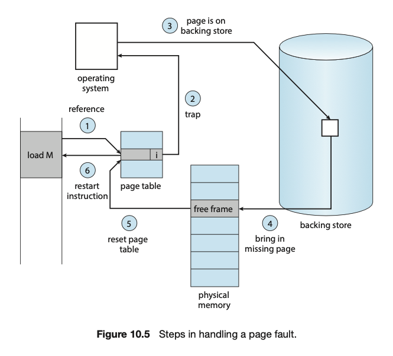

## 💻 가상메모리

### 📌 개요

프로세스는 물리 메모리에 직접 접근하지 않아도 메모리 관리자를 통해 물리 메모리로 연결한다.

32bit CPU = 2^32 = 약 4기가의 가상 메모리

**❓그러면 가상 메모리의 용량을 뛰어넘는 프로세스들을 어떻게 실행되는 것인가?**

-   물리 메모리 내용의 일부를 하드디스크의 스왑 영역으로 이동
-   치리가 필요할 때마다 물리메모리로 가져와서 실행

메모리 관리자는 물리메모리와 스왑영역을 합친 영역에서 가상주소를 물리주소로 변환 **(동적 주소 변환 DAT)**

-   물리 메모리의 0번지는 운영체제 영역이라 사용할 수 없음
-   나머지 영역에 대해 메모리 관리자는 "가변 분할 방식(세그멘테이션)"과 "고정 분할 방식(페이징)"으로 구분하여 나눈다.
    -   세그멘테이션-페이징 혼용기법 사용

메모리 관리자는 **매핑 테이블**(가상주소와 물리 주소 1:1 매핑)을 통해 가상 주소를 물리주소로 저장

### 📌 세그멘테이션(배치정책)

세그멘테이션: 함수, 모듈 등으로 세그먼트를 분할(코드, 힙, 데이터, 스택,,)

-   프로그램 관점에서는 각 세그먼트는 분리되어 있다고 판단 <-> 프로세스는 코드, 데이터, 힙, 스택 영역은 인접하다고 판단

**논리 주소**: 사용자, 프로세스, CPU
**물리 주소**: 물리 메모리

**세그멘테이션 테이블**

-   메모리관리자가 관리
-   Base Address, Bound Address 가 저장

**논리주소에서 물리주소 변환 과정**

1. CPU가 논리주소, 세그멘트 번호 전달
2. 메모리 관리자는 Segment Table Base Register 를 통해 물리 메모리 n 번지에 저장된 세그먼테이션 테이블을 로드
3. 세그멘트 번호를 인덱스로 테이블에서 Base Address, Bound Address 조회
4. Bound Address(메모리 크기)와 논리 주소를 비교
    1. Bound Address > 논리 주소 = Base Address + 논리 주소 = 물리 주소
    2. Bound Address < 논리 주소 = 메모리 침범 -> 에러 발생

-   컨텍스트 스위칭마다 해당 세그멘테이션 테이블에 프로세스의 데이터를 수정 -> 비용이 큰 작업

**장점**

-   각 세그멘테이션이 모듈로 처리되어 분할이 가능하기에 관리가 편함

**단점**

-   외부 단편화 발생 가능

### 📌 페이징(배치정책)

고정 분할 방식: 메모리를 정해진 크기의 페이지로 나누어 관리

-   논리주소공간: 사용자, 프로세스가 바라보는 공간
    -   일정한 크기로 균일하게 구분(페이지)
-   물리주소공간: 실제 메모리에서 사용되는 주소 공간
    -   일정한 크기로 균일하게 구분(프레임)

**페이지 테이블**

1. CPU 논리주소 전달
2. 메모리 관리자는 Page Table Base Register을 통해 물리메모리 n번지에서 페이지 테이블 로드
3. 페이지 번호 = 논리주소 / 페이지 크기
4. 오프셋은 논리주소 % 페이지 크기
5. 페이지 테이블에서 페이지 번호를 인덱스로 프레임, 오프셋를 알아냄
6. 만약 프레임에 `invalid`로 저장되면 스왑영역에 저장

**예시**

1. 2^32 바이트의 CPU는 약 4GB의 가상 메모리 사용
2. 2^24 바이트는 페이지 크기(16MB), 2^8 바이트는 페이지 번호(256개)로 구분
3. 첫 페이지의 마지막 주소는 16777217 (16MB - 2^16)
4. 논리주소 0x31553322 번호 찾기
5. 31553322 / 1677217 = 1...14777216
6. 인덱스번호 1, 오프셋 14777216
7. 페이지 테이블 1번 인덱스의 프레임 번호 + 14777216이 물리주소

**차이점**

1. 세그멘테이션은 Base Address가 필요하지만 페이징은 각 페이지 영역이 동일하여 필요 없음
2. 세그멘테이션 외부 단편화 발생, 페이징 내부 단편화 발생
3. 세그멘테이션 논리적 영역별로 구분, 페이징은 고정된 페이지에 저장하여야 하니 논리적으로 구분 불가
4. 각 프로세스마다 페이지 테이블을 갖고 있기에, 페이지 테이블의 크기 관리가 중요하다.

### 📌 페이지드 세그멘테이션

페이지드 세그멘테이션: 페이지 + 세그멘테이션

메모리 접근 권한 : 메모리 특정 번지에 대한 접근 권한 (R, W, E)

**프로세스**

-   코드: RE
-   데이터: RW(o)
-   힙: RW
-   스택: RW

권한이 없는 메모리 접근 시, 에러 발생

-   세그멘테이션 테이블에 권한 비트 추가
-   Base Address -> Page Number
-   Bound Address -> 세그먼트의 페이지 개수(사실상 동일한 값)

**예시**

1. CPU가 0x12300번지 접근 요청
2. 메모리 관리자가 메모리에서 세그멘테이션 테이블이랑 페이지 테이블 로드
3. 세그먼트 번호를 통해 인덱스를 확인 후, 접근 권한 위반 여부를 파악
4. 페이지 넘버를 통해 페이지 테이블의 프레임 확인
5. 물리 메모리의 프레임 번호 + 접근 요청된 메모리 오프셋 = 물리 주소

**단점**

1. 물리메모리에서 데이터를 가져오기 위해서는 메모리 접근 두 번 해야함 (세그멘테이션 테이블, 페이지 테이블)

### 📌 더 찾아본 점

**❓ 메모리에 없는(invalid)데이터를 어떻게 저장장치에서 가져올까?**

✅ **Demand Paging**: 프로그램 실행 중에 필요한 페이지만 물리 메모리에 저장하고, 실행 중에 요구되는 페이지에 대해서는 저장장치에서 로드
**Page Fault**: 페이지 테이블에서 가져오려는 데이터가 invalid 한 상황. 운영체제에게 trap을 발동시키고 이를 통해 요구되는 페이지를 메모리로 로드

1. 페이지 테이블에서 찾으려난 데이터가 valid인지 invalid인지 확인
2. invalid일 경우, page fault가 발생되고 운영체제의 trap에 걸림.
3. 물리 메모리에서 비어있는 frame 주소를 찾음
4. 제 2 저장장치에서 요구되는 페이지를 찾고 해당 프레임에 할당
5. 물리 주소 프레임 위치를 페이지 테이블에 매핑
6. 인터럽트가 끝나고 프로세스 중단된 명령어부터 다시 실행

### 📌 백엔드 면접 질문

**✏️ V8 엔진의 메모리 관리 방식은?**

✅ V8 엔진은 node.js의 실행 엔진이며 컴파일과 GC를 포함하고 있다.
V8 메모리 구조(Resident set)은 크게 `Heap`과 `Stack` 메모리로 구분된다.

출처: [그림으로 쉽게 배우는 운영체제](https://www.inflearn.com/course/%EB%B9%84%EC%A0%84%EA%B3%B5%EC%9E%90-%EC%9A%B4%EC%98%81%EC%B2%B4%EC%A0%9C/dashboard)
