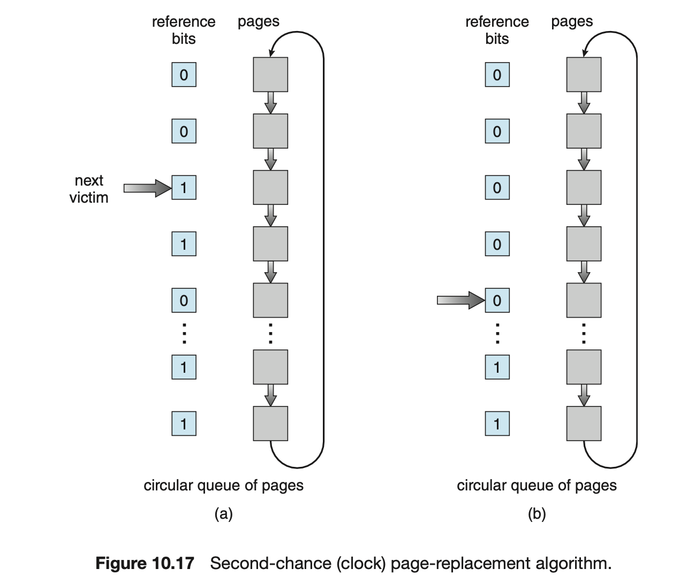
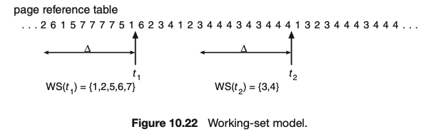

## 💻 가상메모리

### 📌 개요

프로세스는 물리 메모리에 직접 접근하지 않아도 메모리 관리자를 통해 물리 메모리로 연결한다.

32bit CPU = 2^32 = 약 4기가의 가상 메모리

**❓그러면 가상 메모리의 용량을 뛰어넘는 프로세스들을 어떻게 실행되는 것인가?**

-   물리 메모리 내용의 일부를 하드디스크의 스왑 영역으로 이동
-   치리가 필요할 때마다 물리메모리로 가져와서 실행

메모리 관리자는 물리메모리와 스왑영역을 합친 영역에서 가상주소를 물리주소로 변환 **(동적 주소 변환 DAT)**

-   물리 메모리의 0번지는 운영체제 영역이라 사용할 수 없음
-   나머지 영역에 대해 메모리 관리자는 "가변 분할 방식(세그멘테이션)"과 "고정 분할 방식(페이징)"으로 구분하여 나눈다.
    -   세그멘테이션-페이징 혼용기법 사용

메모리 관리자는 **매핑 테이블**(가상주소와 물리 주소 1:1 매핑)을 통해 가상 주소를 물리주소로 저장

### 📌 세그멘테이션(배치정책)

세그멘테이션: 함수, 모듈 등으로 세그먼트를 분할(코드, 힙, 데이터, 스택,,)

-   프로그램 관점에서는 각 세그먼트는 분리되어 있다고 판단 <-> 프로세스는 코드, 데이터, 힙, 스택 영역은 인접하다고 판단

**논리 주소**: 사용자, 프로세스, CPU
**물리 주소**: 물리 메모리

**세그멘테이션 테이블**

-   메모리관리자가 관리
-   Base Address, Bound Address 가 저장

**논리주소에서 물리주소 변환 과정**

1. CPU가 논리주소, 세그멘트 번호 전달
2. 메모리 관리자는 Segment Table Base Register 를 통해 물리 메모리 n 번지에 저장된 세그먼테이션 테이블을 로드
3. 세그멘트 번호를 인덱스로 테이블에서 Base Address, Bound Address 조회
4. Bound Address(메모리 크기)와 논리 주소를 비교
    1. Bound Address > 논리 주소 = Base Address + 논리 주소 = 물리 주소
    2. Bound Address < 논리 주소 = 메모리 침범 -> 에러 발생

-   컨텍스트 스위칭마다 해당 세그멘테이션 테이블에 프로세스의 데이터를 수정 -> 비용이 큰 작업

**장점**

-   각 세그멘테이션이 모듈로 처리되어 분할이 가능하기에 관리가 편함

**단점**

-   외부 단편화 발생 가능

### 📌 페이징(배치정책)

고정 분할 방식: 메모리를 정해진 크기의 페이지로 나누어 관리

-   논리주소공간: 사용자, 프로세스가 바라보는 공간
    -   일정한 크기로 균일하게 구분(페이지)
-   물리주소공간: 실제 메모리에서 사용되는 주소 공간
    -   일정한 크기로 균일하게 구분(프레임)

**페이지 테이블**

1. CPU 논리주소 전달
2. 메모리 관리자는 Page Table Base Register을 통해 물리메모리 n번지에서 페이지 테이블 로드
3. 페이지 번호 = 논리주소 / 페이지 크기
4. 오프셋은 논리주소 % 페이지 크기
5. 페이지 테이블에서 페이지 번호를 인덱스로 프레임, 오프셋를 알아냄
6. 만약 프레임에 `invalid`로 저장되면 스왑영역에 저장

**예시**

1. 2^32 바이트의 CPU는 약 4GB의 가상 메모리 사용
2. 2^24 바이트는 페이지 크기(16MB), 2^8 바이트는 페이지 번호(256개)로 구분
3. 첫 페이지의 마지막 주소는 16777217 (16MB - 2^16)
4. 논리주소 0x31553322 번호 찾기
5. 31553322 / 1677217 = 1...14777216
6. 인덱스번호 1, 오프셋 14777216
7. 페이지 테이블 1번 인덱스의 프레임 번호 + 14777216이 물리주소

**차이점**

1. 세그멘테이션은 Base Address가 필요하지만 페이징은 각 페이지 영역이 동일하여 필요 없음
2. 세그멘테이션 외부 단편화 발생, 페이징 내부 단편화 발생
3. 세그멘테이션 논리적 영역별로 구분, 페이징은 고정된 페이지에 저장하여야 하니 논리적으로 구분 불가
4. 각 프로세스마다 페이지 테이블을 갖고 있기에, 페이지 테이블의 크기 관리가 중요하다.

### 📌 페이지드 세그멘테이션

페이지드 세그멘테이션: 페이지 + 세그멘테이션

메모리 접근 권한 : 메모리 특정 번지에 대한 접근 권한 (R, W, E)

**프로세스**

-   코드: RE
-   데이터: RW(o)
-   힙: RW
-   스택: RW

권한이 없는 메모리 접근 시, 에러 발생

-   세그멘테이션 테이블에 권한 비트 추가
-   Base Address -> Page Number
-   Bound Address -> 세그먼트의 페이지 개수(사실상 동일한 값)

**예시**

1. CPU가 0x12300번지 접근 요청
2. 메모리 관리자가 메모리에서 세그멘테이션 테이블이랑 페이지 테이블 로드
3. 세그먼트 번호를 통해 인덱스를 확인 후, 접근 권한 위반 여부를 파악
4. 페이지 넘버를 통해 페이지 테이블의 프레임 확인
5. 물리 메모리의 프레임 번호 + 접근 요청된 메모리 오프셋 = 물리 주소

**단점**

1. 물리메모리에서 데이터를 가져오기 위해서는 메모리 접근 두 번 해야함 (세그멘테이션 테이블, 페이지 테이블)

### 📌 디멘드 페이징(가져오기 정책)

**지역성 이론**

1. 공간의 지역성: 현재 위치에서 가까운 데이터에 접근 확률이 높음
2. 시간의 지역성: 현재 시간에서 가까운 데이터에 접근 확률이 높음(최근)

**디멘드 페이징**: 필요한 데이터만 메모리에 올리고 사용하지 않는 데이터는 스왑 영역으로 이동

메모리 계층 구조

-   레지스터
-   캐시
-   메인 메모리
-   보조저장장치

보조저장장치에서 데이터를 가져오는 것은 레지스터보다 몇 배는 더 많은 시간이 소요
스왑영역이 보조저장장치에 있기에, 스왑영역에 데이터를 저장하는 것을 최소화해야 함.

**스왑 인(swap in)**: 스왑 영역 -> 물리 메모리
**스왑 아웃(swap out)**: 물리 메모리 -> 스왑 영역

페이지 테이블 엔트리(PTE)

1. 접근 비트: 데이터 접근 여부(읽기, 실행 작업 시, 1)
2. 변경 비트: 데이터 쓰기 여부(쓰기 작업 시, 1)
3. 유효 비트: 페이지가 물리 메모리에 있는지(있음 0)
4. WRE 비트: 접근 권한 비트
5. 프레임: 프레임 번호 저장

**디멘드 페이징 과정**

1. 페이지 테이블에서 유효비트와 프레임 번호를 확인
2. 유효비트가 0일 경우, 물리 메모리에서 해당 프레임 번호로 데이터 반환
3. 1일 경우, 스왑영역에서 프레임 번호로 데이터 추출
4. 물리 메모리에서 빈 프레임을 확인
5. 빈 프레임이 있으면 물리 메모리로 데이터를 적재하고 페이지 테이블 수정
6. 빈 프레임이 없으면 물리 메모리에서 필요하지 않은 데이터를 스왑 영역으로 이동 후, 빈 프레임으로 이동

### 📌 페이지 교체정책

**페이지 교체정책**: 가득찬 메모리에서 스왑영역으로 보낼 페이지를 고르는 기법

1. 무작위 선택(Random): 지역성을 고려하지 않아, 자주 사용되는 페이지가 교체될 수 있음
2. 가장 오래된 페이지 교체(FIFO): 가장 오래된 페이지가 자주 사용될 수도 있음
3. 가장 오랫동안 사용하지 않을 페이지 교체(Optimum): 사실상 구현이 불가(이론상)
4. 최근 사용이 가장 적은 페이지 교체(Least Recently Used)
    1. 지역성 이론에 따라, 최근 사용이 적은 페이지는 앞으로도 사용이 적을 것이다는 추정
    2. optimum 알고리즘과 근접한 성능을 갖지만, 지역성 이론에 따르지 않는다면 성능이 안좋아짐
    3. 시간을 기록하는 비트 수가 많아짐

Belady의 역설: 페이지 폴트를 줄이기 위해 메모리를 늘려 프레임을 늘렸더니 페이지 폴트가 더 많이 발생(FIFO에서 발생)

-   LRU 알고리즘은 성능이 좋지만 구현이 힘듬
-   시간을 기록할 비트가 많이 필요하며, 시간이 오래 지나갈 수록 오버플로우가 발생
-   오버플로우로 값이 초기화 되어 시간을 기록하기 힘듦

**클락 알고리즘(clokc algorithm)**

-   접근 비트를 하나만 이용
-   일정시간마다 접근 비트를 0으로 초기화
-   페이지 조회 시, 접근 비트 1로 수정
-   페이지를 원형으로 연결
-   페이지 폴트 발생 시, 클락 핸드(원형 페이지를 순회하는 포인터)를 시계방향으로 돌려
-   접근 비트가 1이면 0으로 수정하고
-   접근 비트가 0이면 교체할 페이지로 선택

**향상된 클락 알고리즘**

-   접근 비트와 변경 비트 모두 확인
-   접근 비트 0 / 변경 비트 0
-   접근 비트 0 / 변경 비트 1
-   접근 비트 1 / 변경 비트 0
-   접근 비트 1 / 변경 비트 1
-   순서대로 페이지 교체 우선 순위 선정

하드웨어적으로 접근비트를 지원하지 않는 시스템에서 FIFO를 사용해야 함.(FIFO 최적화 필요)

**2차 기회 페이지 교체 알고리즘**

-   FIFO와 동일하게 동작
-   만약 페이지 폴트없이 페이지 접근이 성공하면, 가장 첫 체이지를 큐의 가장 뒤로 이동

### 📌 스레싱과 워킹셋

CPU 사용률을 올리기 위해는 멀티프로그래밍 정도를 올려야 함
(다른 프로세스로 컨텍스트 스위칭을 통해 CPU 사용률을 높일 수 있음)

**스레싱**: CPU 사용률을 높이기 위해 더 많은 프로세스를 실행하지만 물리 메모리의 공간 초과로 스왑에 더 많은 시간이 할당되어 CPU 사용률이 낮아지는 것

-   물리메모리의 크기가 부족하여 스레싱 발생
-   물리적으로 메모리의 성능을 늘리는 것은 한계가 있음(스레싱이 발생하지 않는다면 업그레이드에 대한 효율이 없음)
-   페이지를 적게 할당하면 page fault가 많이 발생 / 페이지를 많이 할당하면 다른 프로세스가 사용할 페이지가 적음
-   프로세스를 실행하며 page fault가 많이 발생하면 페이지를 더 할당
-   page fault가 적게 발생하면 페이지를 조금 할당
-   적절한 페이지 수가 결정되어 지역성 이론에 따라 유지할 페이지들을 골라야 함.
-   **워킹셋**: 현재 메모리에 올라온 페이지는 다시 사용할 확률이 높기 때문에 하나의 세트로 묶어서 메모리에 저장
-   프로세스 준비 -> 실행 상태로 컨텍스트 스위칭할 때 사용된다.

### 📌 더 찾아본 점

**❓ 페이징, 세그멘테이션, 페이지드 세그멘테이션**
✅
**페이지 테이블 엔트리**: 페이지 테이블에서 페이지에 대한 위치 정보를 담은 각 행
**페이징 테이블 구성**
|페이지 번호|프레임번호|유효/무효 비트|
|-|-|-|
|0|5|v|
|1|8|v|
|2|3|i|

1. CPU가 (p,d) 논리주소 전달
2. 페이징 테이블에서 p에 대한 f를 찾고 반환 (i일 경우, trap)
3. 물리 주소 = f 번 프레임의 d 번째 위치 = 페이지 크기 \* f + d

**세그멘테이션 테이블 엔트리**: 세그멘트 테이블에서 세그멘트 주소 정보를 담은 각 행
**세그멘테이션 테이블 구성**
|세그먼트 번호|Base Address|Bound Address (limit)|
|-|-|-|
|0|1000|400|
|1|5000|300|
|2|8000|1000|

1. CPU가 (s,d) 논리주소 전달
2. 세그먼트 테이블에서 s에 대한 base address와 limit 확인
3. d가 limit 보다 크면 에러
4. 물리 주소 = base address + d

**페이지드 세그멘테이션**: 프로세스를 각 세그멘테이션으로 구분하고 세그멘테이션을 고정 크기의 페이지로 분할

-   세그멘테이션 테이블과 페이지 테이블 모두 사용
-   해당 세그먼트 안에 페이지 주소를 찾고 페이지 주소에 오프셋 값을 더해 원하는 데이터 추출

| 세그먼트 번호 | 권한 비트 | 페이지 넘버 | 페이지 개수 |
| ------------- | --------- | ----------- | ----------- |
| 0             | RW        | 2           | 500         |
| 1             | RW        | 0           | 1000        |
| 2             | W         | 1           | 1200        |

| 인덱스 | 프레임 |
| ------ | ------ |
| 0      | 3      |
| 1      | 1      |
| 2      | i      |

1. CPU는 (s,p,d) 논리주소 전달
2. 세그먼트 번호를 통해 p를 확인하고 d와 페이지 개수를 비교하여 메모리 침범인지 확인
3. p를 통해 페이지 테이블에서 인덱스를 확인하고 프레임 번호를 확인
4. 물리 주소: 프레임 번호 시작 주소 + d = f \* 페이지 크기 + d

**❓ 메모리에 없는(invalid)데이터를 어떻게 저장장치에서 가져올까?**

✅ **Demand Paging**: 프로그램 실행 중에 필요한 페이지만 물리 메모리에 저장하고, 실행 중에 요구되는 페이지에 대해서는 저장장치에서 로드
**Page Fault**: 페이지 테이블에서 가져오려는 데이터가 invalid 한 상황. 운영체제에게 trap을 발동시키고 이를 통해 요구되는 페이지를 메모리로 로드

1. 페이지 테이블에서 찾으려난 데이터가 valid인지 invalid인지 확인
2. invalid일 경우, page fault가 발생되고 운영체제의 trap에 걸림(프로세스 대기).
3. 물리 메모리에서 비어있는 frame 주소를 찾음
4. 제 2 저장장치에서 요구되는 페이지를 찾고 해당 프레임에 할당
5. 물리 주소 프레임 위치를 페이지 테이블에 매핑
6. 인터럽트가 끝나고 프로세스 중단된 명령어부터 다시 실행

**❓ no free frams?**

물리메모리에 40개의 프레임이 있는데, 각 프로세스가 10 page 크기의 사이즈를 갖는다.

-   프로세스 실행에 필요한 페이지가 각 5 page 크기라면 물리메모리에 30개의 프레임을 사용하고, 10개의 프레임이 남는다(free frame)
-   하지만 모든 프로세스가 10개의 page가 필수라면 free frame이 없기에 page replacement가 필요
    -   page fault의 수를 줄이는 것이 핵심

**❓ Frame Allocation?**

-   만약 n개의 프레임이 사용가능할 때, n개의 프로세스들은 어떻게 프레임을 할당할 것인가

1. Eqaul allocation: 모든 프로세스는 동일하게 할당
2. Proportional allocation: 프로세스의 사이즈에 따라 할당

3. Global replacement: 모든 프레임 내에서 교체를 할 것인지
4. Local replacement: 프로세스에 할당된 프레임 내에서만 교체할 것인지

**❓ Second-Chance Algorithm?**

1. FIFO 알고리즘에 접근 비트(reference bit)를 추가하여 접근 여부를 파악
2. 0이면 해당 페이지를 교체, 1이면 0으로 수정한 후 다음 FIFO page로 이동

**향상된 Second-Change Algorithm(clock algorithm)**

1. 원형 큐로 생성
2. 포인터가 각 큐를 순회하며 접근 비트가 0인 것을 발견.
3. 최악의 경우(모든 접근 비트가 1), 모든 접근 비트를 0으로 수정하고 FIFO와 동일하게 가장 앞에 페이지를 교체

**❓ Thrashing, Working set?**
프로세스가 page in, page out으로 너무 많은 swapping을 하는 현상

-   많은 프로세스를 메모리에 올려(멀티 프로그래밍) 실행 시키면, 어느 순간 CPU 효율성이 떨어지는 현상
-   프로세스 실행 > page fault > process wait queue > page in > next page > page fault ...

**Working Set**

-   지역성 이론에 따라서 최근에 가장 많이 조회된 페이지들의 집합
-   working set안에 있다 - 자주 참조되는 페이지 / 없다 - 교체 대상 페이지
-   t1 시간에는 {1,2,5,6,7} 로 워킹셋 생성, t2에 {3,4} 로 워킹셋 수정
-   Δ (델타) 를 통해 working set window를 생성하고 그 사이즈를 적절히 정하는게 중요
-   운영체제는 각 프로세스의 working set을 모니터링하면서 사이즈에 맞게 frame을 할당
-   충분한 프레임이 남는다면 프로세스를 더 실행 / 각 프로세스의 워킹셋 총합이 사용가능한 프레임의 수가 초과되면 프로세스 중지
-   이를 통해 멀티 프로그래밍 정도를 높이면서 CPU 효율성을 유지

### 📌 백엔드 면접 질문

**✏️ 페이지 폴트(Page Fault)는 언제 발생하며, 운영체제는 이를 어떻게 처리하는가??**

✅ 페이지 폴트란 프로세스가 논리 주소로 데이터를 요청할 때, 메인 메모리에 데이터가 없는 경우 발생하는 인터럽트이다.
스왑 영역에 저장되어 있는 페이지를 가져오기 위해 프로세스를 대기 상태로 변경 시켜, 운영체제에 트랩을 발생시키고
스왑 영억에서 데이터를 가져와 메인 메모리에 저장하고 페이지 테이블을 다시 변경해서 프로세스를 이어서 실행시킵니다.

**✏️ Node.js에서 가상메모리는 어떻게 관리되는가?**
V8 엔진은 JS코드가 저장되는 `Code segment`, 함수 호출과 실행 컨텍스트를 저장하는 `Call Stack`, 객체와 데이터를 저장하는 `Heap Memory`로 구분된다. V8에서는 페이징 기법을 통해 힙 영역을 가상 메모리로 관리한다. 힙 영역에 각각의 space(new space, old space, large object space,,)들은 페이지로 구성되어 있으며 각 페이지는 large object space를 제외하고는 1MB정도이다. 또한 가비지 컬렉터를 통해 단편화가 많이 일어난 페이지에 대해 메모리 압축을 진행한다. - 살아있는 객체들을 한 곳으로 이동시키고 포인터 갱신

출처: [그림으로 쉽게 배우는 운영체제](https://www.inflearn.com/course/%EB%B9%84%EC%A0%84%EA%B3%B5%EC%9E%90-%EC%9A%B4%EC%98%81%EC%B2%B4%EC%A0%9C/dashboard)
