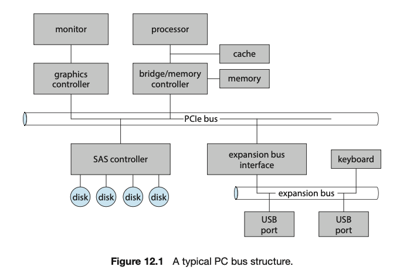
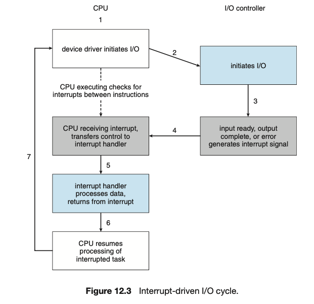

## 💻 입출력 장치

### 📌 주변장치(I/O 디바이스, 저장장치)

주변장치: 그래픽 카드, 하드디스크, SSD, 키보드, 마우스 등

주변장치는 메인보드와 '버스'로 연결되어 있다.

**I/O Device**

-   하드웨어완 연결할 수 있는 **외부 인터페이스**
-   I/O 데이터 전달을 위한 **버스 인터페이스**(address, data, control 버스 3개)
-   장치 상태 및 데이터 저장을 위한 **레지스터**(C메모리로 전달되기도 함)
-   **컨트롤러, 로직**

**주변장치**

데이터 전송 단위에 따른 구분

1. 캐릭터 디바이스
    - 마우스, 키보드, 사운드 카드, 직병렬 카드
    - 데이터 전송단위가 캐릭터(글자)로 작음
2. 블록 디바이스
    - SSD, 하드 디스크, 그래픽 카드
    - 많은 양의 데이터 전송

**과거**에는 CPU가 I/O 디바이스에서 하나의 버스로 데이터를 가져왔음

-   입출력 중에는 CPU가 다른 작업을 못했음

**현재**

1. CPU는 I/O 작업을 입출력 제어기에게 맡기고 다른 작업
2. CPU, 메모리, 그래픽 카드(입출력 장치지만 대용량 데이터를 다룸)는 **시스템 버스**를 이용하고 (고속으로 이용)
3. 입출력 제어기는 **고속 입출력 버스**를 통해 빠른 장치(HDD 등)데이터 전송과 **저속 입출력 버스**를 통해 느린 장치(마우스 키보드 등)
4. 입출력 제어기는 입출력 두 개의 버스에서 온 데이터를 시스템 버스를 통해 메모리로 옮김
5. 입출력 제어기가 메모리에 접근하려면 CPU가 필요한데, 효율성이 떨어지니 DMA(Direct Meomry Access)를 통해 메모리에 저장
6. CPU와 DMA 메모리 공간을 분리 - **Memory Mapped I/O**

### 📌 마우스 / 키보드

**마우스**

1. 과거 볼 마우스는 공의 회전을 감지하여 마우스의 움직임을 계산 -> 불순물이 생기면 움직임 감지를 못함
2. 현재 광학 마우스는 카메라로 초당 1500회를 넘는 사진을 찍어 DSP(Digital Signal Process)에 보내서 마우스 x, y축 좌표를 계산
    - DSP가 데이터를 감지하면 디바이스 컨트롤러는 CPU에게 인터럽트를 보내고
    - 마우스 드라이버가 데이터를 읽어서 > 운영체제에 이벤트 전달 > 애플리케이션으로 Foregroud 애플리케이션 전달 > 애플리케이션은 이벤트 처리

**키보드**

1. 디바이스 컨트롤러는 사용자 입력 감지 및 인터럽트 발생
2. 키보드 드라이버는 운영체제 이벤트 전달
3. Foreground 애플리케이션으로 애플리케이션에 전달
4. 애플리케이션은 이벤트 처리

### 📌 하드디스크/Flash Memory(SSD)

**하드디스크의 구조**

sector: track에서 여러개의 sector로 나뉘고 하드디스크의 가장 작은 단위
track: platter에 여러개의 track이 존재하고 표면의 자성으로 N극은 0, S극은 1
platter: 원판 형태로 데이터 저장
cylinder: 모든 헤드는 같이 움직이고 여러개의 헤드가 가리키는 트랙의 집합
spindle: platter를 지지하는 막대
read/write head: disk arm에 달려있어, platter의 표면을 읽음

**과정**

1. cylinder C로 가서 track B에 있는 sector D를 읽어라
2. disk arm은 헤드를 cylinder C로 이동시키고(seek, seek time < 하드 디스크가 느린 이유)
3. track B에 Sector D가 head에 닿을때까지 spindle을 회전

**Flash Memory**

**- 하드디스크**

-   기계적으로 움직여 소음도 일어나고 속도가 느림
-   자기적으로 처리 -> 고장 가능성이 높음
-   충격에 약함

**- flash memory**

-   전기적으로 데이터를 읽기 때문에 조용하고 속도가 빠름
-   안전함
-   덮어쓰기가 불가능
-   지우기 가능한 횟수가 정해져있어서, 지우고 쓰기가 여러번 쓰일 수 없음

### 📌 더 찾아본 점

**❓ 주변장치, I/O device, 저장장치의 차이점**
✅

1. **주변장치**: 컴퓨터 본체의 외부에 연결되어 동작하는 장치들
    - 입출력 장치, 저장장치를 모두 포함
2. **I/O device**: 입출력 기능을 수행하는 장치
    - 키보드, 마우스, 모니터, 스피커,
3. **저장장치**: 데이터를 저장,보관,읽기, 쓰기 하는 역할을 수행하는 장치
    - 주기억 장치: RAM
    - 보조기억 장치: HDD, SSD
    - 캐시 & 레지스터

**❓ 시스템 버스, 고속/저속 입출력 버스 차이**
✅

**Bus**: 컴퓨터 내부에서 데이터가 이동하는 통로, 여러 장치들이 데이터를 주고받을 수 있도록 하는 공유 전송 시스템

**PCIe** (Peripheral Component Interconnect Express)
CPU-메모리 서브시스템과 고속 장치들(그래픽카드, 네트워크 카드 등)을 연결

**확장 버스(expansion bus)**: 상대적으로 느린 장치(키보드, usb등) 연결

**SAS(Serial Attached SCSI)**: 여러 개의 디스크를 연결하는 스토리지 전용 버스

-   SCSI(Samll Computer Systems Interface): 컴퓨터에 주변기기를 연결할 때 직렬 방식 연결 표준

**Memory-Mapped I/O** : I/O 장치의 Control Registers를 물리 메모리 주소 공간에 할당하는 방식

**❓ 입출력 장치의 I/O 인터럽트가 발생해도 끊김이 없는 이유?**
✅

1. `interrupt-request line`을 통해 CPU는 명령어를 실행한 후 인터럽트가 발생하였는지 감지
2. 현재 실행 중인 프로세스의 데이터, 상태를 저장
3. 인터럽트 핸들러를 실행
4. 인터럽트의 원인을 확인하고 필요한 작업을 수행
5. 수행 후, 상태값을 복원하여 이전 작업으로 복귀

아무런 작업이 없는 컴퓨터에서 10초 동안 23,000개의 인터럽트가 발생 - 초당 수백개의 인터럽트를 처리해야 함.

현재 운영체제에서는 조금 더 철학적인 interrupt handling 특징들이 있음

1. 중요한 프로세스 작업 중 인터럽트 핸들링을 지연시킬 능력이 필요하다
2. polling을 통한 인터럽트 발생 확인이 아닌, 적절한 인터럽트 핸들러를 통해 효율적으로 인터럽트 관리
3. multilevel interrupt를 통해 상위 - 하위 우선순위의 인터럽트를 구분하고 여러 인터럽트 동발생 시, 긴급성에 따라 응답
4. 운영체제의 attention을 바로 받을 수 있을 만한 명령어가 필요 (page fault는 trap)

### 📌 백엔드 면접 질문

**✏️ 페이지 폴트(Page Fault)는 언제 발생하며, 운영체제는 이를 어떻게 처리하는가??**

✅ 페이지 폴트란 프로세스가 논리 주소로 데이터를 요청할 때, 메인 메모리에 데이터가 없는 경우 발생하는 인터럽트이다.
스왑 영역에 저장되어 있는 페이지를 가져오기 위해 프로세스를 대기 상태로 변경 시켜, 운영체제에 트랩을 발생시키고
스왑 영억에서 데이터를 가져와 메인 메모리에 저장하고 페이지 테이블을 다시 변경해서 프로세스를 이어서 실행시킵니다.

**✏️ Node.js에서 가상메모리는 어떻게 관리되는가?**
V8 엔진은 JS코드가 저장되는 `Code segment`, 함수 호출과 실행 컨텍스트를 저장하는 `Call Stack`, 객체와 데이터를 저장하는 `Heap Memory`로 구분된다. V8에서는 페이징 기법을 통해 힙 영역을 가상 메모리로 관리한다. 힙 영역에 각각의 space(new space, old space, large object space,,)들은 페이지로 구성되어 있으며 각 페이지는 large object space를 제외하고는 1MB정도이다. 또한 가비지 컬렉터를 통해 단편화가 많이 일어난 페이지에 대해 메모리 압축을 진행한다. - 살아있는 객체들을 한 곳으로 이동시키고 포인터 갱신

출처: [그림으로 쉽게 배우는 운영체제](https://www.inflearn.com/course/%EB%B9%84%EC%A0%84%EA%B3%B5%EC%9E%90-%EC%9A%B4%EC%98%81%EC%B2%B4%EC%A0%9C/dashboard)
