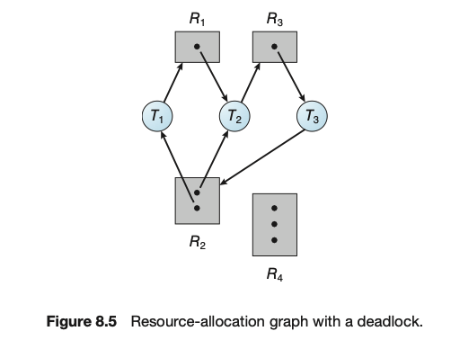

## 💻 데드락

### 📌 데드락이란?

**교착상태**: 여러 프로세스가 서로 다른 프로세스의 작업이 끝나기를 기다리다가 아무도 작업을 진행하지 못하는 상태

-   하나의 공유자원을 여러 프로세스가 차지하려다가 교착상태가 발생함

**필요조건**

1. 상호배제: 한 프로세스가 리소스를 점유하였다면 다른 프로세스 접근 불가
2. 비선점: 점유중인 프로세스의 리소스를 뺏어갈 수 없음
3. 점유와 대기: 한 프로세스는 리소스를 점유하고 있는 상태에서 다른 프로세스의 리소스 점유를 대기해야 함
4. 원형대기: 점유와 대기를 하는 프로세스들의 관계가 원형이어야 함.

### 📌 데드락 해결

교착생태 회피: 교착상태가 이루어지지 않을 정도로만 프로세스에게 자원을 할당

-   전체 자원과 할당된 자원으로 '안정상태', '불안정상태'로 분류된다.
-   "은행원 알고리즘": 은행의 여윳돈과 빌려준 돈들을 보고 '안정상태'인지 확인하고 돈을 빌려준다.
-   전체 자원의 수: **시스템 총 자원**
-   프로세스들이 각자 필요한 최대 자원: **최대 요구 자원**

**안정상태** ex) 시스템 총 자원 = 14

| 프로세스 | 최대 **요구** 자원 | 현재 할당 자원 | 요청 예상 자원 |
| -------- | ------------------ | -------------- | -------------- |
| P1       | 9                  | 5              | 4              |
| P2       | 6                  | 4              | 2              |
| P3       | 4                  | 3              | 1              |

1. 현재 총 12개의 작업이 할당되었다.
2. P1이 4개의 자원을 요청하면 사용 가능한 자원이 2(14-12)개 남아있기에 거절
3. P2가 2개의 자원 요청하면 사용 가능한 자원 2개 할당
4. P2의 작업이 마무리되면 사용 가능한 자원 6개로 증가
5. 나머지 프로세스들의 요청 예상 자원 커버 가능

**불안정상태** ex) 시스템 총 자원 = 14

| 프로세스 | 최대 요구 자원 | 현재 할당 자원 | 요청 예상 자원 |
| -------- | -------------- | -------------- | -------------- |
| P1       | 9              | 7              | 4              |
| P2       | 6              | 4              | 2              |
| P3       | 4              | 2              | 1              |

1. 현재 사용 가능 자원은 1(14-13)개이다.
2. 모든 프로세스들의 요청 예상 자원을 할당해줄 수 없다.
3. 모든 프로세스들이 최대 자원을 요구하지 않는다면 교착 상태에 빠지지 않을 수 있지만
4. 가능성이 높다

**교착상태의 발생은 막을 수 없다. 발생 후 해결방법을 고민**

1. **가벼운 교착상태 검출**: 타이머 이용. 프로세스가 일정 시간동안 작업을 진행하지 않는다면 교착상태로 검출
    - 일정시간마다 체크포인트 생성, 교착상태 예상 시에 롤백
2. **무거운 교착상태 검출**: '자원 할당 그래프'를 통해 프로세스에 할당된 자원을 모니터링
    - 교착상태를 일으킨 프로세스 강제종료
    - 체크포인트로 롤백

### 📌 더 찾아본 점

**❓자원할당그래프(Resource-Allocation Graph)가 뭐야?**

✅ 운영체제에서 자원이 할당되어 있는 상태를 그래프로 그려, 시각적으로 데드락의 여부를 판단

-   T = {T1, T2, ..., Tn}: 실행 중인 쓰레드
-   R = {R1, R2, ..., Rm}: 할당될 자원 타입
-   T_i → R_j: i 쓰레드가 j 자원을 요청한다
-   R_j → T_i: j 자원을 i 쓰레드에 할당되어 있다.

위 예제에서는 3개의 쓰레드와 4개의 자원이 있으며 2개의 순환 구조를 갖고 있다.

T1 → R1 → T2 → R3 → T3 → R2 → T1
T2 → R3 → T3 → R2 → T2

모든 쓰레드는 하나의 자원을 점유 중인 상태에서 다음 자원을 점유하기 위해 대기 상태에 있고, 이러한 상태가 원형을 이루어지고 있기 때문에 데드락에 빠질 확률이 높다고 판단한다.

출처: [그림으로 쉽게 배우는 운영체제](https://www.inflearn.com/course/%EB%B9%84%EC%A0%84%EA%B3%B5%EC%9E%90-%EC%9A%B4%EC%98%81%EC%B2%B4%EC%A0%9C/dashboard)
