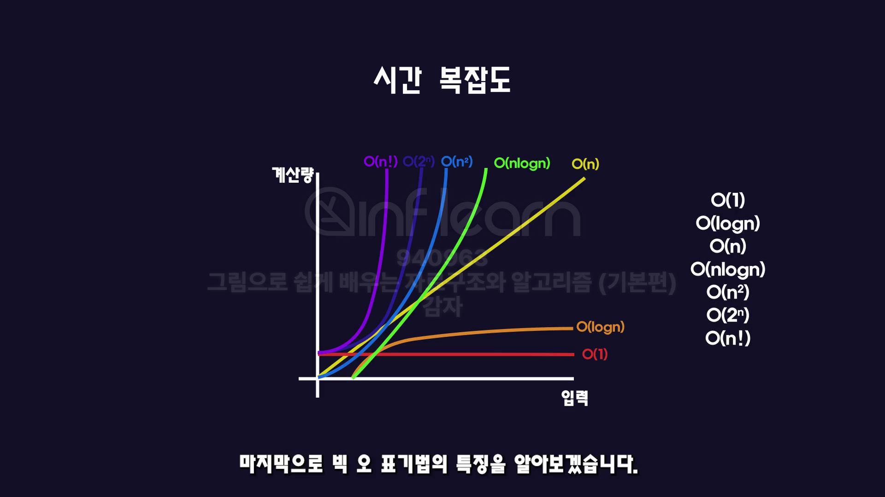

## 💻 자료구조

### 📌자료구조와 알고리즘이란?

#### 자료구조

데이터를 **효율적**으로 저장하고 관리하는 방식

#### 알고리즘

어떤 문제를 해결하기 위한 절차나 방법이며 자료구조에 따라서 다양한 알고리즘 방식이 채택될 수 있다.

```javascript
// ✅ 효율적인 자료구조
// 1. 각각의 변수에 데이터를 저장
let a = 87;
let b = 70;
let c = 100;
// 2. 배열 자료구조에 데이터를 모두 저장
let arr = [87, 70, 100];

// ✅ 효율적인 알고리즘
// 1. 첫 번째부터 세 번째 값을 더한 후, 3으로 나눈다.
let average = (a + b + c) / 3;

// 2. 모든 값을 더한 후, 배열의 길이만큼 나눈다.
let average_2 = 0;

for (let i = 0; i < arr.length; i++) {
    average_2 += average_2[i];
}

average_2 /= arr.length;

// 값이 추가될수록 2번 알고리즘은 2번 자료구조에 값만 추가하면되기에 효율적이라고 할 수 있다.
```

### 📌시간복잡도

사용자의 요구사항에 따라 더 좋은 알고리즘의 기준이 달라진다.
일반적으로는 **알고리즘의 속도**를 성능의 척도로 사용한다.

#### 시간 복잡도

특정 알고리즘이 어떤 문제를 해결하는데 걸리는 시간.
실질적인 시간을 측정하는 것이 아닌, 코드에서 **성능에 영향을 주는 부분을 찾아** 시간을 예측하는 것(반복문)

-   **최선**의 경우 : **빅-오메가(Big-Ω)**
-   **평균**의 경우 : **빅-세타(Big-Θ)**
-   **최악**의 경우 : **빅-오(Big-O)**

#### 시간 복잡도의 종류

1. **O(1)** → "입력 크기와 상관없이 일정한 시간" (상수)
2. **O(log n)** → "반씩 줄어드는 경우" (로그)
3. **O(n)** → "입력 크기만큼 반복" (선형)
4. **O(n log n)** → "정렬 알고리즘에서 자주 등장" (선형 로그)
5. **O(n²)** → "중첩 반복문 사용" (이차)
6. **O(n³)** → "세 개의 중첩 반복문" (삼차)
7. **O(2ⁿ)** → "피보나치 재귀" (지수)
8. **O(n!)** → "모든 경우의 수 탐색" (팩토리얼)



예를 들어 `3n² + 100n` 의 성능에서 시간 복잡도는 **가장 많은 영향**을 주는 항을 통해 도출한다.

해당 계산식에서 시간복잡도는 `O(n²)`이다.

### 📌 더 찾아본 점

**❓ 왜 가장 많은 영향을 주는 항만 도출하여 시간복잡도를 계산할까?**

✅ 해당 식의 최고차항을 제외한 모든 항과 최고차항의 계수를 제거시켜서 시간복잡도를 계산한다. 전체적인 관점에서 최고차항의 영향이 압도적으로 커치기 때문에 다른 항의 계산을 제외시킨다.

| n         | O(1) | O(log n) | O(n)   | O(n log n) | O(n²)     | O(n³)     | O(2^n)     | O(n!)       |
| --------- | ---- | -------- | ------ | ---------- | --------- | --------- | ---------- | ----------- |
| **10**    | 1    | 3.32     | 10     | 33.2       | 100       | 1000      | 1024       | 3,628,800   |
| **100**   | 1    | 6.64     | 100    | 664        | 10,000    | 1,000,000 | 1.27e+30   | 9.33e+157   |
| **1000**  | 1    | 6.97     | 1000   | 6,970      | 1,000,000 | 1e+9      | 1.07e+301  | 4.02e+2567  |
| **10000** | 1    | 9.97     | 10,000 | 99,700     | 1e+8      | 1e+12     | 1.07e+3010 | 3.32e+35659 |

**❓ 공간 복잡도(Space Complexity)**

✅ 알고리즘이 실행되는 동안 사용되는 메모리 공간의 양

출처: [그림으로 쉽게 배우는 자료구조와 알고리즘](https://www.inflearn.com/course/%EC%9E%90%EB%A3%8C%EA%B5%AC%EC%A1%B0-%EC%95%8C%EA%B3%A0%EB%A6%AC%EC%A6%98-%EA%B8%B0%EB%B3%B8/dashboard)
