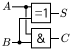

### 📗 컴퓨터 구조
|A|B|`AND`|`OR`|`XOR`|`NOT`|
|-|-|-|-|-|-|
|0|0|0|0|0|1|
|0|1|0|1|1|0|
|1|0|0|1|1|
|1|1|1|1|0|

- `AND` : 두 값이 `true`일 경우, `true`
- `OR` : 하나의 값이라도 `true`일 경우, `true`
- `XOR` : 두 값이 서로 다르면 `true`
- `NOT` : 하나의 값의 반대

#### 덧셈



- `S(sum)` : A와 B의 XOR 을 따른다.
- `C(carry)` : A와 B의 AND를 따른다. (자리 올림)

예시) 
1. A=0, B=1 일 경우, S=1. C=0이며 01(2)를 의미
2. A=1, B=1 일 경우, S=0. C=1이며 10(2)를 의미

#### 뺄셈

**보수** : 보충해주는 수. 예를 들어 4의 10의 보수는 6이다.

보수를 통해 뺄셈을 덧셈으로 해결 가능하다. 

```
6 + 4 = 10
13 - 6 = 7

6의 10의 보수는 4이다.
13에 6의 10의 보수인 4를 더하면 17이다.
17에서 10의 자리를 제거하면 7이다.
```

2진수에서 뺄셈은 **1의 보수**를 사용하여 덧셈을 활용한다.

- **1의 보수** : 각 비트를 반전(`NOT`)
- **2의 보수** : 1의 보수 + 1

````
13 = 1101(2)
6 = 0110(2)

6의 1의 보수 = 1001(2)
6의 2의 보수 = 1001(2) + 0001(2) = 1010(2)

1101(2) + 1010(2) = 10111(2) => 0111(2) (오버플로우 제거)

0111(2) = 7
````

#### 곱셈
1. 4bit로 5를 표현하면 0101(2)
2. 0101(2) << 1 = 1010(2)
3. 1010(2) = 10

2의 배수의 곱셈이 아니라면 덧셈 여러번

#### 나눗셈
1. 4bit로 6을 표현하면 0110(2)
2. 0110(2) >> 1 = 0011(2)
3. 0011(2) = 3

2의 배수의 나눗셈이 아니라면 뺄셈 여러번

#### 컴퓨터의 연산

CPU를 통해 연산을 하며 필요한 데이터를 RAM에서 가져와 계산 후 결과 값을 다시 RAM에 저장한다.

1. **레지스터(Register)** : CPU 내부에 있는 가장 빠른 메모리
2. **캐시 메모리(Cache)** : CPU 내부 혹은 가까운 위치에 있는 고속 메모리로, 자주 사용하는 데이터를 미리 예측 후 저장해 놓은다.
3. **RAM(Random Access Memory)** : 전원이 꺼지면 데이터가 사라지는 휘발성 메모리로, 실행 중인 프로그램과 데이터를 저장한다.
4. **SSD / HDD / USB / DISK** : 보조기억장치
5. **Backup Device(Cloud Storage)** : 인터넷을 이용한 원격 저장


1~3 까지 주기억장치에 해당하며 4~5는 보조기억장치이다. 

주기억장치는 CPU가 직접 접근하여 데이터를 읽고 쓰는 빠른 메모리를 의미하며 프로그램 실행 시, 임시로 저장하는 역할이다.

보조기억장치는 데이터를 영구적으로 저장하는 장치이며 속도는 느리지만 용량이 크다.
